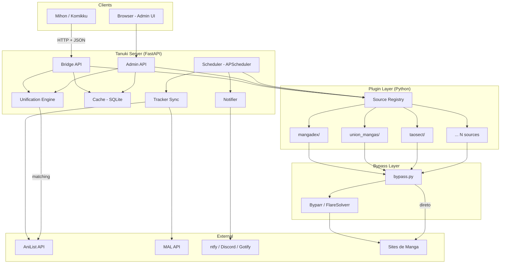
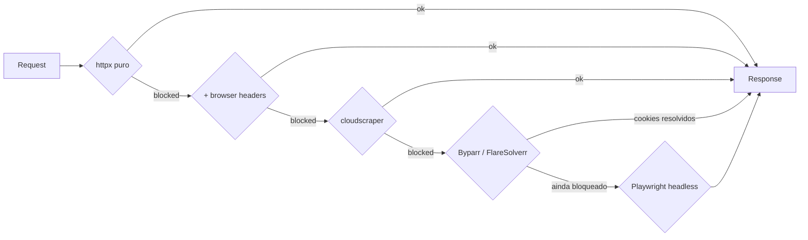
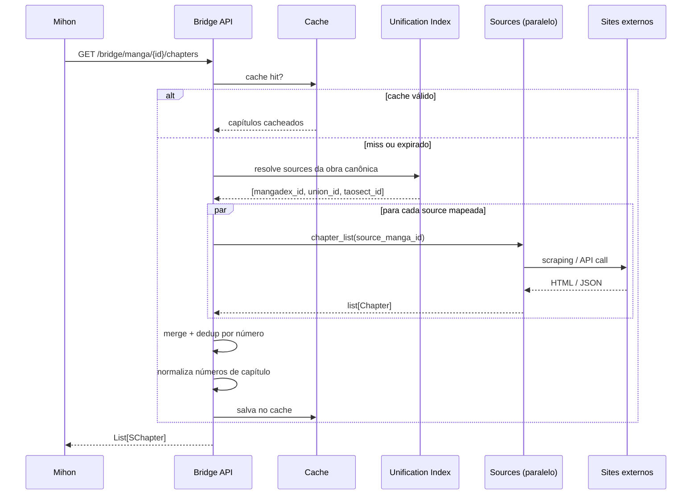
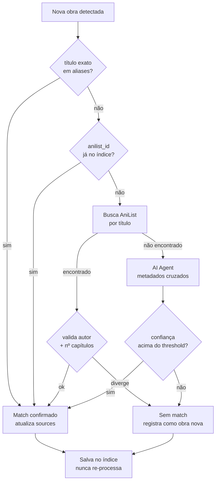
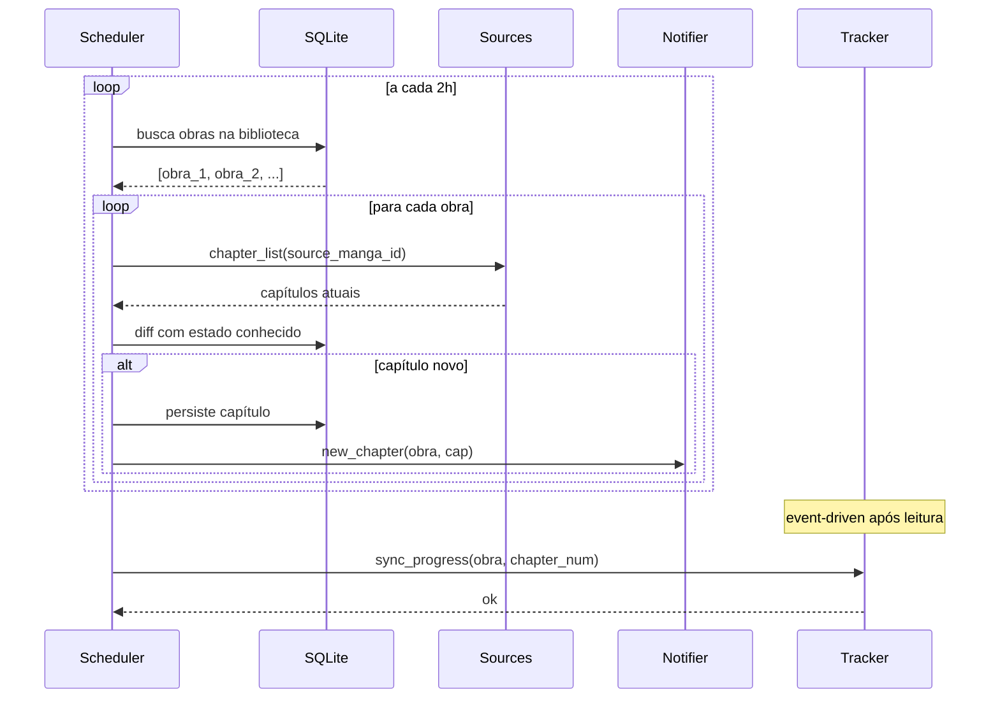
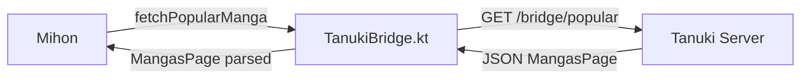

# IDEA.md -- Tanuki Technical Design Document

> Este documento descreve como o Tanuki funciona internamente, quais são seus componentes, como eles se comunicam, e quais contratos de dados ele precisa respeitar.

---

## Objetivo Final

Tanuki é um **aggregator self-hosted de manga e manhwa** que:

1. Roda scraping de múltiplas fontes em paralelo via um sistema de plugins Python
2. Unifica obras canonicamente entre fontes distintas
3. Expõe uma API padronizada que o Mihon/Komikku consome como se fosse uma source nativa
4. Gerencia background jobs (polling de capítulos, notificações, sync com trackers) server-side, independente de dispositivo
5. Oferece uma interface de administração minimalista via browser

O usuário final sobe um container Docker, instala a extensão bridge no Mihon, aponta pro servidor, e esquece. O servidor cuida do resto.

---

## Visão Geral dos Componentes



---

## 1. Plugin System (Python)

### Design

Cada source é um **módulo Python** dentro de `sources/`. O `SourceRegistry` descobre e carrega os plugins automaticamente na inicialização -- sem registro manual, sem config extra além de habilitar o nome no `config.yaml`.

A classe base `TanukiSource` define o contrato que todo plugin implementa. O registry injeta a infraestrutura compartilhada (HTTP client, bypass) automaticamente no load.

### Contrato base

```python
# core/source.py
from abc import ABC, abstractmethod
from dataclasses import dataclass, field
from enum import IntEnum
from datetime import datetime


class MangaStatus(IntEnum):
    UNKNOWN   = 0
    ONGOING   = 1
    COMPLETED = 2
    HIATUS    = 3
    CANCELLED = 4


@dataclass
class Manga:
    id: str
    title: str
    thumbnail_url: str | None = None
    description: str | None   = None
    author: str | None        = None
    artist: str | None        = None
    status: MangaStatus       = MangaStatus.UNKNOWN
    genres: list[str]         = field(default_factory=list)


@dataclass
class MangaPage:
    items: list[Manga]
    has_next_page: bool


@dataclass
class Chapter:
    id: str
    manga_id: str
    number: float
    title: str | None      = None
    date_upload: datetime  = field(default_factory=datetime.utcnow)
    scanlator: str | None  = None


@dataclass
class Page:
    index: int
    image_url: str


@dataclass
class SearchFilters:
    status: MangaStatus | None = None
    genres: list[str]          = field(default_factory=list)
    lang: str | None           = None


class TanukiSource(ABC):
    # metadata -- obrigatório declarar na subclasse
    id: str
    name: str
    lang: str
    version: str = "1.0.0"
    base_url: str

    # capabilities -- declaradas na subclasse, infra injetada pelo registry
    needs_bypass: bool = False
    use_browser: bool  = False

    # injetados pelo SourceRegistry no load
    client: "AsyncClient"      # httpx com retry, rate limit, headers
    bypass: "CloudflareBypass" # abstração Byparr/FlareSolverr

    # -- interface obrigatória --

    @abstractmethod
    async def popular(self, page: int) -> MangaPage: ...

    @abstractmethod
    async def latest(self, page: int) -> MangaPage: ...

    @abstractmethod
    async def search(self, query: str, page: int, filters: SearchFilters) -> MangaPage: ...

    @abstractmethod
    async def manga_detail(self, manga_id: str) -> Manga: ...

    @abstractmethod
    async def chapter_list(self, manga_id: str) -> list[Chapter]: ...

    @abstractmethod
    async def page_list(self, chapter_id: str) -> list[Page]: ...

    # -- opcionais --

    async def ping(self) -> bool:
        """Health check leve. Override se o site tiver endpoint melhor."""
        try:
            await self.client.get(self.base_url, timeout=5)
            return True
        except Exception:
            return False
```

### Exemplo de source

```python
# sources/union_mangas/__init__.py
from core.source import TanukiSource, Manga, MangaPage, Chapter, Page, SearchFilters
from selectolax.parser import HTMLParser


class UnionMangasSource(TanukiSource):
    id           = "union_mangas"
    name         = "Union Mangás"
    lang         = "pt-BR"
    base_url     = "https://unionmangas.top"
    needs_bypass = True

    async def popular(self, page: int) -> MangaPage:
        resp = await self.client.get(f"{self.base_url}/manga/?page={page}")
        return self._parse_listing(resp.text)

    async def chapter_list(self, manga_id: str) -> list[Chapter]:
        resp = await self.client.get(f"{self.base_url}{manga_id}")
        ...

    def _parse_listing(self, html: str) -> MangaPage:
        tree = HTMLParser(html)
        ...
```

### Source Registry

```python
# core/registry.py
import importlib
import pkgutil
from pathlib import Path
from core.source import TanukiSource


class SourceRegistry:
    def __init__(self):
        self._sources: dict[str, TanukiSource] = {}

    def load_all(self, sources_dir: Path, enabled: list[str]) -> None:
        for _, name, _ in pkgutil.iter_modules([str(sources_dir)]):
            if name not in enabled:
                continue
            module = importlib.import_module(f"sources.{name}")
            for attr in vars(module).values():
                if isinstance(attr, type) and issubclass(attr, TanukiSource) and attr is not TanukiSource:
                    instance = attr()
                    self._inject(instance)
                    self._sources[instance.id] = instance

    def _inject(self, source: TanukiSource) -> None:
        source.client = build_client(source)  # httpx com headers, retry, rate limit
        source.bypass = build_bypass(source)  # Byparr se needs_bypass=True

    def get(self, source_id: str) -> TanukiSource:
        return self._sources[source_id]

    def all(self) -> list[TanukiSource]:
        return list(self._sources.values())
```

---

## 2. Bypass Layer

Nem todo site precisa do mesmo nível de tratamento. O `build_client` e `build_bypass` escolhem automaticamente baseado nas flags declaradas pelo source.



O source declara `needs_bypass = True` e ganha o nível 4 automaticamente. O client injeta os cookies resolvidos em todas as requests do mesmo domínio -- o plugin não precisa saber que o bypass aconteceu.

Byparr e FlareSolverr expõem a mesma API na porta 8191 -- o server trata os dois de forma idêntica.

---

## 3. Bridge API

Interface que a extensão Kotlin do Mihon consome. O contrato segue os tipos esperados pelo Mihon (`SManga`, `SChapter`, `Page`, `MangasPage`).

### Endpoints

| Método | Endpoint | Retorna |
|---|---|---|
| GET | `/bridge/sources` | sources disponíveis no server |
| GET | `/bridge/popular?source=X&page=1` | `MangasPage` |
| GET | `/bridge/latest?source=X&page=1` | `MangasPage` |
| GET | `/bridge/search?source=X&q=...&page=1` | `MangasPage` |
| GET | `/bridge/manga/{canonical_id}` | `SManga` |
| GET | `/bridge/manga/{canonical_id}/chapters` | `List[SChapter]` |
| GET | `/bridge/chapter/{chapter_id}/pages` | `List[Page]` |
| POST | `/bridge/chapter/{chapter_id}/read` | `OK` + dispara AniList sync |

Todas as requests carregam `X-Tanuki-Key` no header. A extensão Kotlin guarda a key via `SharedPreferences`.

### Response schemas

**MangasPage**
```json
{
  "mangas": [
    {
      "url": "/manga/solo-leveling",
      "title": "Solo Leveling",
      "thumbnail_url": "https://...",
      "status": 2,
      "author": "Chugong",
      "description": "...",
      "genre": "Action, Fantasy, Adventure"
    }
  ],
  "has_next_page": true
}
```

**SChapter**
```json
{
  "url": "/chapter/solo-leveling-100",
  "name": "Chapter 100",
  "date_upload": 1714000000000,
  "chapter_number": 100.0,
  "scanlator": "Reaperscans"
}
```

**Page**
```json
{
  "index": 0,
  "image_url": "https://cdn.site.com/pages/100/001.jpg"
}
```

---

## 4. Fluxo de uma Request do Mihon



---

## 5. Unification Engine

### Problema

A mesma obra existe em N sources com IDs completamente diferentes. O Tanuki precisa reconhecer que `mangadex/32d76d19`, `union_mangas/solo-leveling`, e `taosect/solo-leveling-4` são a mesma obra.

### Índice canônico

```json
{
  "canonical_id": "solo-leveling",
  "anilist_id": 101517,
  "mal_id": 121496,
  "titles": ["Solo Leveling", "나 혼자만 레벨업", "Only I Level Up"],
  "sources": {
    "mangadex":     "32d76d19-8c34-4c41-b854-9f04b25ec6b7",
    "union_mangas": "/manga/solo-leveling",
    "taosect":      "solo-leveling-4"
  }
}
```

### Fluxo de matching



### Chapter Normalization

```
"Capítulo 100"       → 100.0   regex
"Cap 100.5"          → 100.5   regex
"Vol.4 Ch.12"        → 12.0    regex
"第100話"             → 100.0   regex unicode
"Oneshot"            → 0.0     regex
"Season 2 Episode 3" → ???     AI fallback (contexto de outros caps)
```

Resultado cacheado por `(source_id, raw_chapter_id)`.

---

## 6. Background Jobs



| Job | Trigger | O que faz |
|---|---|---|
| `check_new_chapters` | interval 2h | varre biblioteca, detecta capítulos novos |
| `notify_updates` | event-driven | dispara quando capítulo novo é detectado |
| `health_check_sources` | interval 30min | ping em cada source, atualiza status |
| `sync_tracker` | event-driven | chamado após `/bridge/chapter/{id}/read` |
| `rebuild_unification_index` | cron semanal | re-processa matches ambíguos |
| `cache_cleanup` | cron diário | remove entradas expiradas |

---

## 7. Persistência

SQLite via SQLAlchemy async. Um único arquivo `data/tanuki.db` -- sem PostgreSQL, sem Redis.

```sql
CREATE TABLE canonical_works (
    id          TEXT PRIMARY KEY,
    anilist_id  INTEGER UNIQUE,
    mal_id      INTEGER UNIQUE,
    title       TEXT NOT NULL,
    aliases     JSON NOT NULL DEFAULT '[]',
    sources     JSON NOT NULL DEFAULT '{}',
    created_at  INTEGER NOT NULL,
    updated_at  INTEGER NOT NULL
);

CREATE TABLE chapters (
    id              TEXT PRIMARY KEY,
    work_id         TEXT NOT NULL REFERENCES canonical_works(id),
    source_id       TEXT NOT NULL,
    source_chap_id  TEXT NOT NULL,
    number          REAL NOT NULL,
    title           TEXT,
    date_upload     INTEGER NOT NULL,
    scanlator       TEXT,
    UNIQUE(source_id, source_chap_id)
);

CREATE TABLE read_progress (
    work_id     TEXT NOT NULL REFERENCES canonical_works(id),
    chapter_id  TEXT NOT NULL REFERENCES chapters(id),
    read_at     INTEGER NOT NULL,
    PRIMARY KEY (work_id, chapter_id)
);

CREATE TABLE source_health (
    source_id       TEXT PRIMARY KEY,
    status          TEXT NOT NULL,  -- healthy | degraded | down
    last_check      INTEGER NOT NULL,
    last_latency_ms INTEGER,
    error_message   TEXT
);

CREATE TABLE response_cache (
    key        TEXT PRIMARY KEY,
    value      TEXT NOT NULL,
    expires_at INTEGER NOT NULL
);
```

---

## 8. Admin API + UI

### Endpoints

| Método | Endpoint | O que faz |
|---|---|---|
| GET | `/admin/sources` | sources carregados, status, versão |
| GET | `/admin/sources/{id}/health` | ping + latência |
| POST | `/admin/sources/{id}/reload` | hot reload do módulo Python |
| GET | `/admin/library` | obras no índice canônico |
| POST | `/admin/library/{id}/refresh` | força re-fetch de capítulos |
| DELETE | `/admin/library/{id}` | remove do índice |
| GET | `/admin/jobs` | jobs agendados + histórico |
| POST | `/admin/jobs/{id}/run` | executa job manualmente |
| GET | `/admin/config` | configuração atual |
| PUT | `/admin/config` | atualiza configuração |
| GET | `/admin/health` | status geral do server |

### UI (HTMX + Jinja2)

Servida pelo próprio FastAPI em `/`. Sem build step, sem JS framework.

- **Dashboard** -- status geral, sources ativos, jobs recentes
- **Sources** -- lista com saúde, latência média, última execução
- **Library** -- obras indexadas, sources mapeados, capítulos conhecidos
- **Jobs** -- histórico, próximos agendamentos, logs
- **Config** -- formulário de configuração

---

## 9. Extensão Kotlin (Bridge)

A extensão é thin por design -- todo estado e lógica vive no server.



Implementa `HttpSource` + `ConfigurableSource` + `SourceFactory`. A `SourceFactory` chama `/bridge/sources` na inicialização e instancia um `TanukiSource` por entry -- o usuário vê cada source como uma source separada no Mihon.

**Tela de configuração nativa:**
```kotlin
override fun setupPreferenceScreen(screen: PreferenceScreen) {
    EditTextPreference(screen.context).apply {
        key          = PREF_SERVER_URL
        title        = "Tanuki Server URL"
        setDefaultValue("http://192.168.1.100:8000")
    }.also(screen::addPreference)

    EditTextPreference(screen.context).apply {
        key   = PREF_API_KEY
        title = "API Key"
    }.also(screen::addPreference)
}
```

---

## 10. Notificações

```yaml
notifications:
  ntfy_topic: "tanuki-updates"
  discord_webhook: "https://discord.com/api/webhooks/..."
  gotify_url: "http://gotify:8080"
  gotify_token: "..."
```

O `Notifier` abstrai os adaptadores -- todos disparam em paralelo:

```python
@dataclass
class NotificationPayload:
    title: str
    body: str
    url: str | None = None

class Notifier:
    async def new_chapter(self, work: CanonicalWork, chapter: Chapter) -> None:
        payload = NotificationPayload(
            title=work.title,
            body=f"Capítulo {chapter.number} disponível",
            url=f"tanuki://manga/{work.id}",
        )
        await asyncio.gather(*[a.send(payload) for a in self.adapters])
```

---

## 11. Setup do Usuário

```yaml
# docker-compose.yml
services:
  tanuki:
    image: ghcr.io/felipeadeildo/tanuki:latest
    ports:
      - "8000:8000"
    volumes:
      - ./config.yaml:/app/config.yaml:ro
      - ./data:/app/data
    depends_on:
      byparr:
        condition: service_healthy
    restart: unless-stopped

  byparr:
    image: ghcr.io/thephaseless/byparr:latest
    ports:
      - "8191:8191"
    healthcheck:
      test: ["CMD", "curl", "-f", "http://localhost:8191/health"]
      interval: 30s
    restart: unless-stopped
```

```yaml
# config.yaml
server:
  port: 8000
  secret_key: "gerar-com-openssl-rand-hex-32"

sources:
  enabled:
    - mangadex
    - union_mangas
    - taosect

bypass:
  solver_url: "http://byparr:8191"

tracker:
  anilist_token: ""
  mal_client_id: ""

notifications:
  ntfy_topic: ""
  discord_webhook: ""

scheduler:
  chapter_check_interval_hours: 2
  health_check_interval_minutes: 30
```

---

## 12. Estrutura do Repositório

```
tanuki/
├── IDEA.md
├── PROPOSAL.md
├── LICENSE                         # AGPL-3.0
├── README.md
├── docker-compose.yml
├── config.yaml.example
│
├── core/
│   ├── models.py                   # Manga, Chapter, Page, CanonicalWork
│   ├── source.py                   # TanukiSource ABC
│   ├── registry.py                 # SourceRegistry -- discovery + injeção
│   ├── client.py                   # httpx pool, retry, rate limit, headers
│   ├── bypass.py                   # abstração Byparr / FlareSolverr
│   ├── cache.py                    # cache layer (SQLite)
│   └── config.py                   # pydantic-settings
│
├── server/
│   ├── main.py                     # FastAPI app + lifespan
│   ├── bridge_api.py               # endpoints /bridge/*
│   ├── admin_api.py                # endpoints /admin/*
│   ├── scheduler.py                # APScheduler jobs
│   ├── notifier.py                 # ntfy / discord / gotify
│   ├── tracker.py                  # AniList, MAL sync
│   └── ui/
│       ├── templates/              # Jinja2
│       └── static/
│
├── unification/
│   ├── engine.py                   # orquestrador de matching
│   ├── agent.py                    # AI agent para casos ambíguos
│   ├── normalizer.py               # chapter number normalization
│   └── index.py                    # SQLAlchemy models + queries
│
├── sources/                        # plugins Python
│   ├── _base.py                    # helpers compartilhados
│   ├── mangadex/
│   │   ├── __init__.py             # MangaDexSource(TanukiSource)
│   │   └── README.md
│   ├── union_mangas/
│   │   ├── __init__.py
│   │   └── README.md
│   └── taosect/
│       ├── __init__.py
│       └── README.md
│
└── bridge/                         # extensão Kotlin para Mihon
    ├── build.gradle.kts
    ├── AndroidManifest.xml
    └── src/main/kotlin/
        ├── TanukiBridgeFactory.kt
        ├── TanukiSource.kt
        └── TanukiPreferences.kt
```

---

## Decisões de Design

| Decisão | Escolha | Motivo |
|---|---|---|
| Plugin system | módulos Python com ABC | baixa barreira de contribuição, PR = source nova |
| Discovery de plugins | `pkgutil` + `importlib` | zero config manual, auto-discover |
| Server framework | FastAPI | async nativo, tipagem, Pydantic |
| Background jobs | APScheduler in-process | sem Redis/Celery no MVP |
| Persistência | SQLite + SQLAlchemy async | self-hosted, sem infra extra |
| Bypass | Byparr (+ FlareSolverr compat) | mais leve, desenvolvimento ativo, mesma API |
| Admin UI | HTMX + Jinja2 | sem build step, sem JS framework |
| Unificação | AniList/MAL como fonte de verdade + AI fallback | IDs estáveis, cobertura alta |
| Licença | AGPL-3.0 | impede fork fechado de projeto self-hosted |
